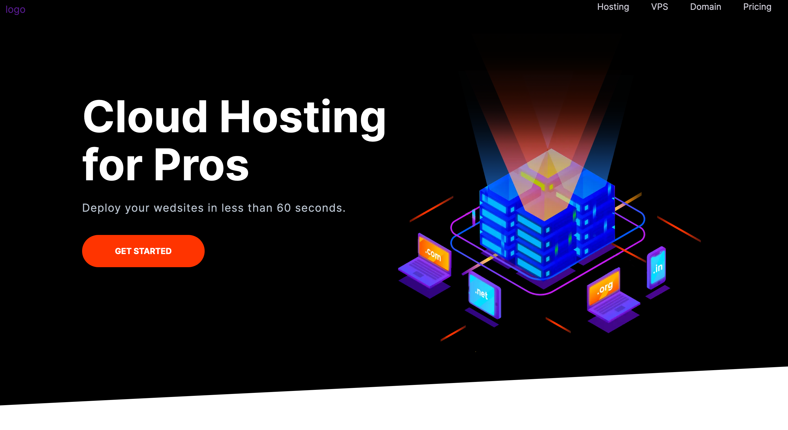

# This is the Final project of the Ultimate HTML5 and CSS3 Series course at [Code With Mosh](https://codewithmosh.com/)

## Table of contents

  - [Screenshot](#screenshot)

  - [Links](#links)

  - [Built with](#built-with)

### Screenshot

### Links

- Live Site URL: [https://fromlukdev.github.io/Moshify/]

### Built with
- Semantic HTML5 markup
- CSS custom properties
- Flexbox
- CSS Grid
- Mobile-first workflow

    

